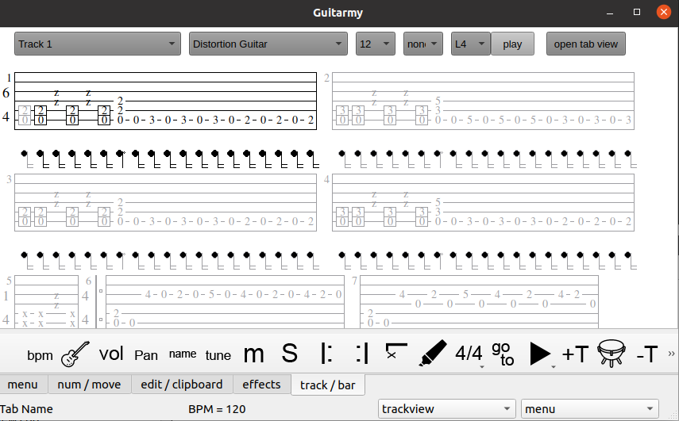

# guitrarmy_qwidgets
Tablature editor

It can read guitar pro files 3, 4, 5. Generate midi and pcm from them.
And also it can read an write files in out format.

Additional inputs availible.

Projects was abadoned for years, there where done a lot of mistakes, but still I have a hope to recover it, and make a free tablature solution for mobile and desktop.

# few screenshots

Main tab view:

Lets you view, edit and play tablature.

Tap rhythm:

One of most annoying thing with guitar tabs - write correct rhythm. This option helped to tap it on screen by fingers.

Pattern input:

And another option to write drums - to use pattern input.

There were few more features:

* Monofonic tab recognizer, it wasn't accurate, applicature was sometimes incorrect, but in some cases it worked fine. Yet old deprecated version removed. Later new version would be added after mtherapp research.

* Morze input, easter egg - letting you generate rhythm from text.

This and few more inputs are planed in QML version.
Development on QML version continues when most parts of this project would be cleaned and refactored. (QML version already has playback feature, repo is closed yet).

# other info

For mistakes that I made with this project read MISTAKED.md

For personal history of this project read HISTORY.md

